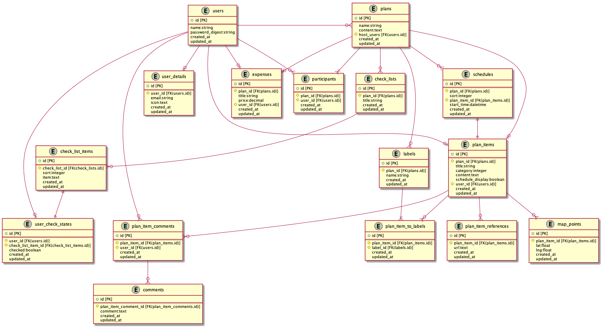

# OurTrip
## 概要
Webを通して計画を計画する際にそのサポートをしてくれるWebサイトです。

## バージョン情報
- Rails
  - 5.2.4
- Ruby
  - 2.6.5
- PostgreSQL
  - 12.2

## 機能一覧
- ユーザー機能
  - ユーザー情報の登録
  - ユーザー情報の編集
- GestUser
  - ユーザーが作成したプランに対してGestUserを発行する
  - ユーザーが作成したGestUserのパスワードをリセットする
  - ユーザーが作成したGestUserを削除する
- プラン
  - 各ユーザーが行きたい場所を登録する
  - 上記で作成したプランを作成する
- チェックリスト
  - チェックリストを作成する
  - チェックリストをチェックする
  - チェックリストを確認する
- 会計
  - 掛かった費用を登録する
  - 費用を割り勘する際の金額を表示する

## 設計
- カタログ設計
  - https://docs.google.com/spreadsheets/d/1_9TniFWZGfS6F2vsR7lUj-vMjea6-rJn-6nDzZYDYkA/edit#gid=0
- テーブル設計
  - https://docs.google.com/spreadsheets/d/18lUxXdxaolQJIts1rn7-lgO6FVkM5VKDpLO4Kf37GhE/edit?usp=sharing
- ER図
  - doc/table.puml
  - 
- 画面遷移
  - doc/diagram.dio
  - https://app.diagrams.net/#G1ISW5D05s2irvficf8AmZPUD1tzARDc28
- 画面設計
  - doc/screen.dio
  - https://app.diagrams.net/#G1gICtZxxr1gSnYVNoC3Q6HtoAY7NS90p_

## 使用予定Gem
- react-rails
- webpacker
- activerecord-import

## 使用技術
- 就業Term
  - AWS
  - コメント機能
- 就業Term外
  - React
  - Docker